# Vizanti 설치 및 사용 가이드

> **대상 환경:** Ubuntu 22.04 + ROS 2 Humble  
> **Vizanti 버전:** vizanti-patrol (커스텀 위젯 포함)  
> **최종 수정:** 2026-04  
> **문의:** [wego robotics discourse](https://wego-robotics.discourse.group/)

---

## 목차

1. [Vizanti란?](#1-vizanti란)
2. [시스템 구성 및 포트](#2-시스템-구성-및-포트)
3. [설치](#3-설치)
4. [실행](#4-실행)
5. [웹 UI 기본 조작](#5-웹-ui-기본-조작)
6. [기본 제공 위젯](#6-기본-제공-위젯)
7. [커스텀 위젯 — Auto Mapping Panel](#7-커스텀-위젯--auto-mapping-panel)
8. [커스텀 위젯 — Explorer Status](#8-커스텀-위젯--explorer-status)
9. [커스텀 위젯 — Map Manager](#9-커스텀-위젯--map-manager)
10. [커스텀 위젯 — Patrol Route](#10-커스텀-위젯--patrol-route)
11. [문제 해결](#11-문제-해결)

---

## 1. Vizanti란?

Vizanti는 ROS 2 로봇을 스마트폰·태블릿·PC 브라우저에서 실시간으로 모니터링하고 제어할 수 있는 **웹 기반 시각화/제어 도구**입니다. RViz의 top down view를 웹으로 구현하며, 인터넷 없이 로봇의 핫스팟에 연결해서도 동작합니다.

이 프로젝트에서는 순찰 로봇 운용에 필요한 **커스텀 위젯 4개**가 추가된 `vizanti-patrol` 버전을 사용합니다.

---

## 2. 시스템 구성 및 포트

Vizanti를 포함한 전체 스택의 포트 구성은 다음과 같습니다.

| 포트 | 서비스 | 역할 |
|------|--------|------|
| **5000** | Vizanti Web UI | 브라우저로 접속하는 메인 화면 |
| **5001** | rosbridge WebSocket | Vizanti ↔ ROS 2 토픽/서비스 통신 |
| **8080** | patrol\_api REST | 커스텀 위젯 ↔ 백엔드 제어 API |

<p align="center">
  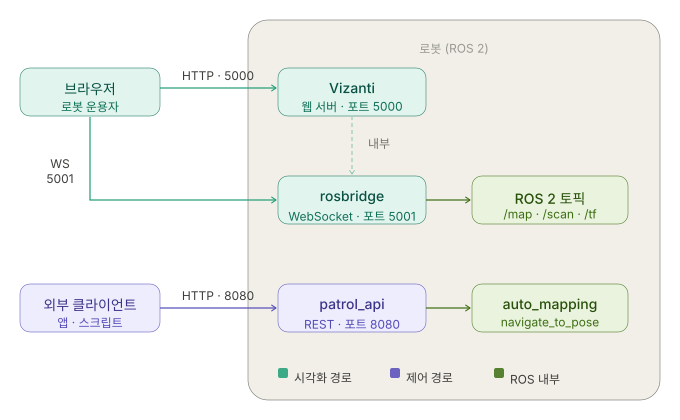
</p>

> **참고:** `auto_mapping`과 `patrol_api`는 별도 deb 패키지로 배포됩니다. Vizanti만 소스 빌드하면 됩니다.

---

## 3. 설치

### 3-1. 사전 조건

- Ubuntu 22.04
- ROS 2 Humble 설치 완료
- `colcon`, `rosdep` 설치 완료

### 3-2. 소스 클론 및 빌드

```bash
cd ~/colcon_ws/src
git clone https://github.com/your-org/vizanti-patrol.git

cd ~/colcon_ws
rosdep install -i --from-path src/vizanti-patrol -y
colcon build --packages-select vizanti_server vizanti_msgs vizanti_cpp vizanti_demos
source install/setup.bash
```

> **팁:** `--symlink-install` 옵션을 사용하면 위젯 HTML/JS 파일 수정 후 재빌드 없이 바로 반영됩니다.
> ```bash
> colcon build --symlink-install --packages-select vizanti_server vizanti_msgs vizanti_cpp
> ```

### 3-3. Docker를 이용한 설치 (선택)

소스 빌드 환경을 구성하기 어렵거나 ROS 버전이 다른 경우 Docker를 사용할 수 있습니다.

```bash
git clone https://github.com/your-org/vizanti-patrol.git
cd vizanti-patrol

# ROS_DISTRO가 설정되지 않은 경우 humble 또는 jazzy로 직접 지정
docker build -f docker/Dockerfile -t vizanti-patrol:latest . --build-arg ROS_VERSION=$ROS_DISTRO
```

실행:
```bash
docker run --rm -it --net=host \
  -e ROS_DOMAIN_ID=$ROS_DOMAIN_ID \
  -e RMW_IMPLEMENTATION=$RMW_IMPLEMENTATION \
  -e USE_RWS=false \
  -v /dev/shm:/dev/shm \
  vizanti-patrol:latest
```

---

## 4. 실행

### 4-1. 전체 스택 일괄 기동 (권장)

`auto_mapping` 패키지가 설치되어 있으면 아래 명령 하나로 전체 스택(SLAM, Nav2, rosbridge, Vizanti, frontier_explorer, patrol_api)을 순서대로 기동합니다.

```bash
ros2 launch auto_mapping auto_mapping.launch.py
```

기동 순서:

| 순서 | 노드 | 준비 신호 |
|------|------|-----------|
| 1 | SLAM Toolbox | `/map` 토픽 퍼블리시 시작 |
| 2 | Nav2 bringup | `navigate_to_pose` 액션 서버 준비 (10~20초) |
| 3 | rosbridge\_server `:5001` | WebSocket 대기 |
| 4 | Vizanti `:5000` | 웹 서버 대기 |
| 5 | frontier\_explorer *(10초 지연)* | `FrontierExplorer 노드 시작됨` 로그 |
| 6 | patrol\_api\_server `:8080` *(10초 지연)* | REST API 대기 |

### 4-2. Vizanti만 단독 실행

다른 노드(SLAM, Nav2 등)가 이미 실행 중일 때 Vizanti와 rosbridge만 따로 띄우려면:

```bash
# rosbridge 포함 (기본 권장)
ros2 launch vizanti_server vizanti_server.launch.py

# RWS 백엔드 사용 시 (CPU 부하 ~5배 감소, CycloneDDS 기본 지원)
ros2 launch vizanti_server vizanti_rws.launch.py
```

### 4-3. 웹 UI 접속

Vizanti가 실행되면 같은 네트워크의 어느 기기에서든 브라우저로 접속할 수 있습니다.

```
http://<로봇_IP>:5000
```

> **모바일 기기 주의:** 로봇 핫스팟에 연결 후 페이지가 열리지 않으면 **모바일 데이터를 끄세요.** 모바일 데이터가 켜져 있으면 패킷이 잘못된 게이트웨이로 나가 접속이 실패합니다.

---

## 5. 웹 UI 기본 조작

### 5-1. 화면 구성

<p align="center">
  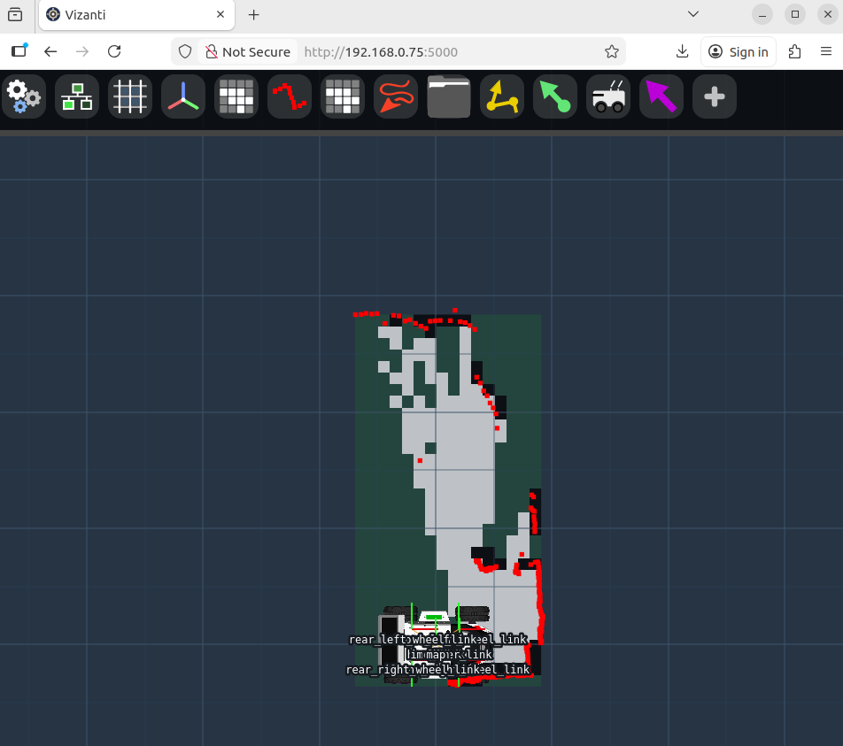
</p>

Vizanti UI는 크게 두 영역으로 구성됩니다.

- **지도 영역 (중앙):** ROS 토픽을 오버레이하여 실시간으로 렌더링되는 2D 맵 뷰
- **아이콘바 (상단 또는 측면):** 추가된 위젯들의 아이콘 목록. 아이콘을 누르면 해당 위젯 패널이 열립니다.

### 5-2. 지도 조작

| 동작 | PC | 모바일 |
|------|----|--------|
| 이동 | 드래그 | 한 손가락 드래그 |
| 확대/축소 | 마우스 휠 | 두 손가락 핀치 |
| 로봇 중심으로 이동 | 로봇 아이콘 클릭 | — |

### 5-3. 위젯 추가

<p align="center">
  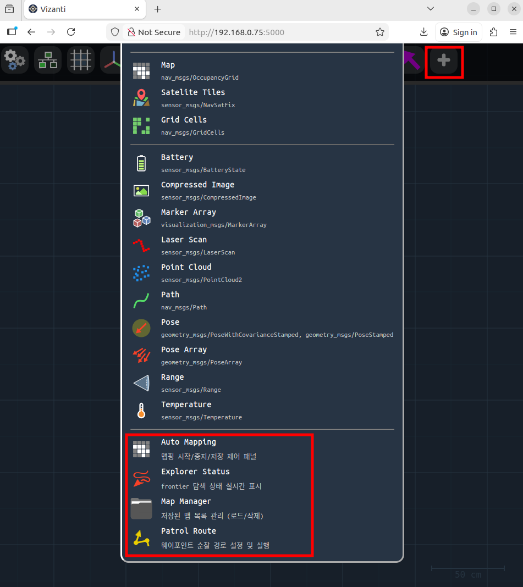
</p>

1. 아이콘바의 **`+` (Add)** 버튼을 누릅니다.
2. 추가할 위젯 종류를 목록에서 선택합니다.
3. 추가된 위젯 아이콘이 아이콘바에 나타납니다.
4. vizanti-patrol의 네 위젯은 리스트 하단에 있습니다.

### 5-4. rosbridge 연결 상태 확인

<p align="center">
  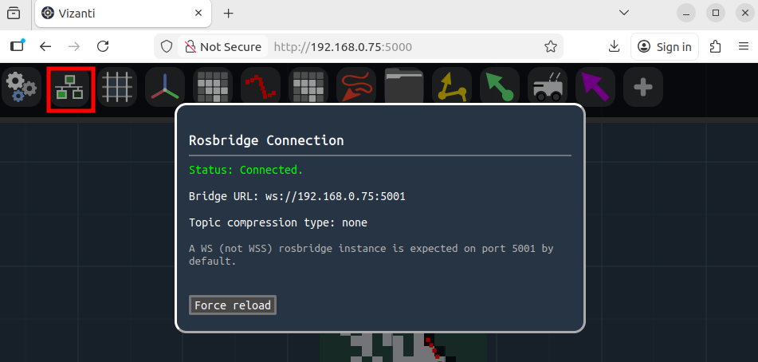
</p>

아이콘바의 **rosbridge 아이콘** 색상으로 연결 상태를 확인합니다.

| 아이콘 | 상태 |
|--------|------|
| 초록색 (연결됨) | ROS 2와 정상 통신 중 |
| 빨간색 (끊김) | rosbridge 미실행 또는 IP 불일치 |

연결이 되지 않으면 rosbridge 아이콘을 클릭하여 WebSocket 주소를 확인·수정합니다. 기본값은 `ws://<현재접속IP>:5001`이며, 로봇 IP와 일치해야 합니다.

---

## 6. 기본 제공 위젯

Vizanti에 기본으로 포함된 주요 위젯입니다.

| 위젯 | 기능 |
|------|------|
| **Map** | `/map` 토픽의 OccupancyGrid를 지도로 렌더링 |
| **Scan** | `/scan` 토픽의 LaserScan을 점으로 표시 |
| **TF** | TF 트리의 좌표 프레임을 지도 위에 표시 |
| **Robot Model** | 로봇의 현재 위치와 방향을 아이콘으로 표시 |
| **Initial Pose** | `/initialpose`로 AMCL 초기 위치 설정 |
| **Simple Goal** | `navigate_to_pose`로 단일 목표 지점 전송 |
| **Waypoints** | 여러 경유지를 순서대로 전송 |
| **Teleop** | 가상 조이스틱으로 `/cmd_vel` 퍼블리시 |
| **Node Manager** | ROS 2 노드 목록 확인 및 재시작 |
| **Rosbag** | rosbag 녹화 시작/중지 |

---

## 7. 커스텀 위젯 — Auto Mapping Panel

### 개요

자율 탐색 맵핑(frontier-based exploration)을 **시작·중지·저장**하는 위젯입니다. 백엔드의 `patrol_api`(`http://<로봇IP>:8080`)와 REST로 통신합니다.


### 패널 구성

<p align="center">
  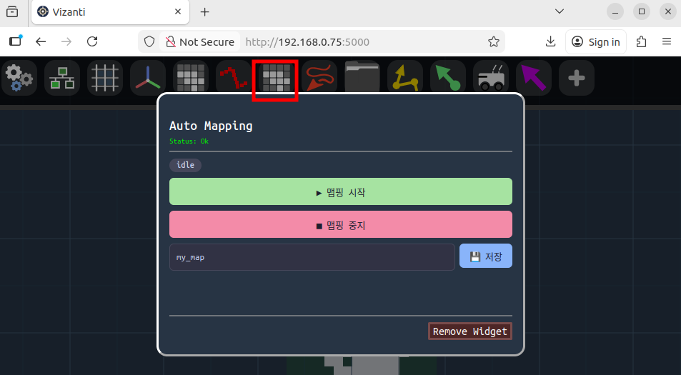
</p>


| UI 요소 | 설명 |
|---------|------|
| **상태 뱃지** | 현재 맵핑 상태를 색상으로 표시 (아래 표 참고) |
| **▶ 맵핑 시작** | 자율 탐색 시작. 탐색 중에는 비활성화됨 |
| **■ 맵핑 중지** | 탐색 중지. 중지 후 맵 자동 저장. 대기 중에는 비활성화됨 |
| **맵 이름 입력창** | 저장할 맵 파일 이름 (기본값: `my_map`) |
| **💾 저장** | 입력한 이름으로 현재 맵을 `~/maps/`에 저장 |
| **하단 로그** | 마지막 API 요청 결과 메시지 표시 |

**상태 뱃지 색상:**

| 색상 | 상태 값 | 의미 |
|------|---------|------|
| 초록 | `exploring` | 탐색 진행 중 |
| 주황 | `saving` | 맵 저장 중 |
| 회색 | `idle` | 대기 중 |
| 빨강 | `error` | patrol\_api 연결 실패 |

### 사용 방법

1. `auto_mapping` 전체 스택이 실행 중인지 확인합니다.
2. **▶ 맵핑 시작** 버튼을 누릅니다. 상태 뱃지가 `exploring`(초록)으로 바뀌면 로봇이 스스로 이동하며 지도를 생성합니다.
3. 탐색이 완료되거나 중단하려면 **■ 맵핑 중지** 버튼을 누릅니다.
4. 맵 이름 입력창에 이름을 입력하고 **💾 저장**을 눌러 맵 파일을 저장합니다.

### 백엔드 연동

| 버튼 | API 호출 |
|------|----------|
| ▶ 맵핑 시작 | `POST /api/mapping/start` |
| ■ 맵핑 중지 | `POST /api/mapping/stop` |
| 💾 저장 | `POST /api/map/save` `{"name": "<입력값>"}` |
| (상태 폴링, 3초마다) | `GET /api/status` |

---

## 8. 커스텀 위젯 — Explorer Status

### 개요

자율 탐색의 진행 상황을 실시간으로 표시하는 위젯입니다. rosbridge를 통해 `/explore/status` 토픽을 직접 구독하므로, `patrol_api` 없이도 동작합니다.

<p align="center">
  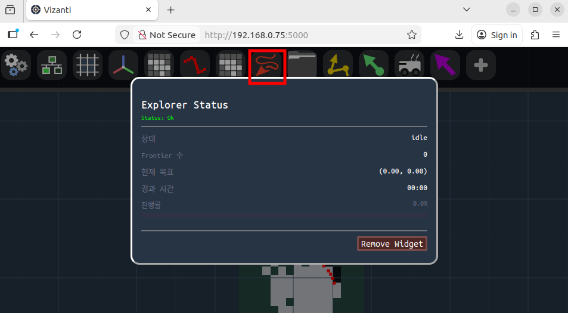
</p>

### 패널 구성

<p align="center">
  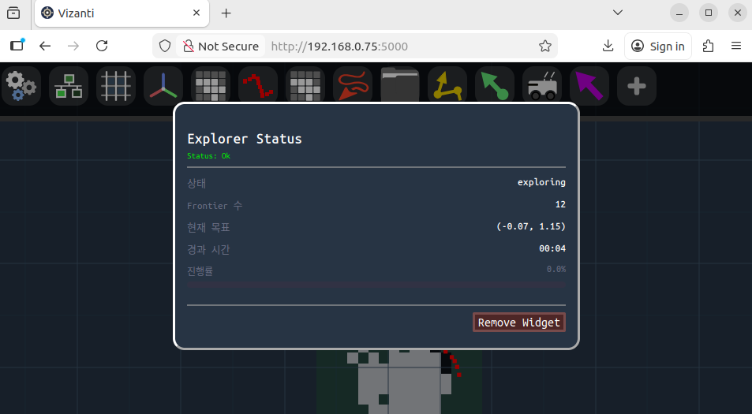
</p>

| UI 요소 | 표시 내용 |
|---------|-----------|
| **상태** | `idle` / `exploring` / `saving` |
| **Frontier 수** | 현재 탐지된 미탐색 경계 셀 클러스터 수 |
| **현재 목표** | 로봇이 향하고 있는 좌표 `(x, y)` |
| **경과 시간** | 탐색 시작 후 경과 시간 `MM:SS` |
| **진행률 바** | 추정 탐색 완료율 (%) |

### 사용 방법

위젯을 추가하는 것만으로 자동으로 구독을 시작합니다. 별도 설정 없이 frontier_explorer 노드가 실행 중이면 실시간으로 데이터가 표시됩니다.

> **Frontier 수가 0으로 유지되는 경우:** SLAM 미실행 또는 TF가 없는 상태입니다. 로봇을 수동으로 조금 이동시킨 후 재확인하세요.

### 백엔드 연동

```
rosbridge WS :5001
  └─ 구독: /explore/status (std_msgs/String, 1 Hz)
           JSON 파싱 → UI 업데이트
```

---

## 9. 커스텀 위젯 — Map Manager

### 개요

`~/maps/` 디렉토리에 저장된 맵 파일 목록을 조회하고, 원하는 맵을 **로드하거나 삭제**하는 위젯입니다.

### 패널 구성

<p align="center">
  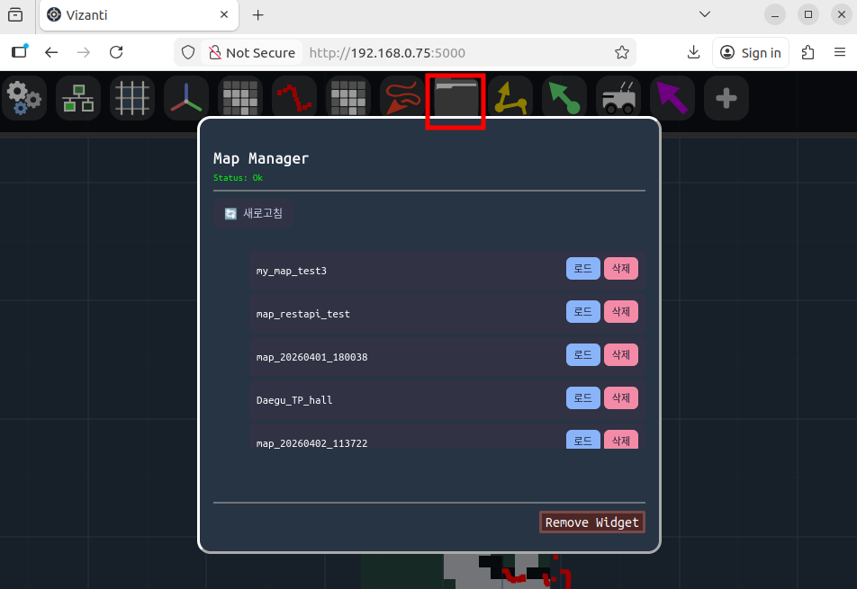
</p>

| UI 요소 | 설명 |
|---------|------|
| **🔄 새로고침** | `GET /api/maps`를 호출하여 맵 목록을 다시 불러옴 |
| **맵 목록** | 저장된 맵 파일 이름 목록 |
| **로드** (각 항목) | 해당 맵을 map\_server로 로드하여 Nav2에 적용 |
| **삭제** (각 항목) | 해당 맵 파일을 서버에서 삭제 |
| **하단 로그** | 마지막 요청 결과 표시 |

### 사용 방법

1. 패널을 열면 자동으로 맵 목록을 불러옵니다.
2. 사용할 맵 옆의 **로드** 버튼을 누릅니다.
3. Vizanti의 Map 위젯에서 해당 맵이 표시되면 정상적으로 로드된 것입니다.
4. 필요 없는 맵은 **삭제** 버튼으로 제거합니다.

> **로드 후 Map 위젯에 지도가 표시되지 않는 경우:** Map 위젯 설정에서 토픽이 `/map`으로 설정되어 있는지 확인하세요.

### 백엔드 연동

| 동작 | API 호출 |
|------|----------|
| 목록 조회 (자동/새로고침) | `GET /api/maps` |
| 맵 로드 | `POST /api/map/load` `{"name": "<맵이름>"}` |
| 맵 삭제 | `DELETE /api/maps/<맵이름>` |

---

## 10. 커스텀 위젯 — Patrol Route

### 개요

순찰 경로를 편집하고 로봇에 순찰 임무를 지시하는 위젯입니다. 웨이포인트를 좌표 입력 또는 **지도 클릭(편집 모드)**으로 추가할 수 있으며, 경로를 서버에 저장하고 불러올 수 있습니다.


### 패널 구성

<p align="center">
  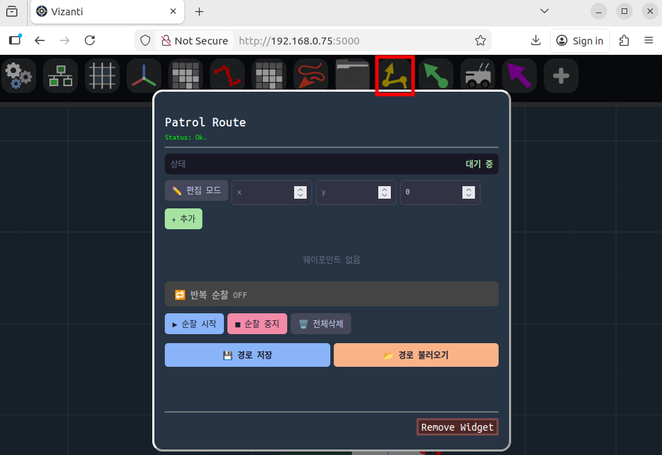
</p>

| UI 요소 | 설명 |
|---------|------|
| **상태** | 현재 순찰 상태 (`대기 중` / `순찰 중` 등) |
| **✏️ 편집 모드** | 활성화 시 지도를 클릭하면 해당 위치가 웨이포인트로 추가됨 |
| **x / y / yaw 입력창** | 좌표를 직접 입력하여 웨이포인트 추가 |
| **+ 추가** | 입력한 좌표를 웨이포인트 목록에 추가 |
| **웨이포인트 목록** | 추가된 웨이포인트 순서 목록. ▲▼로 순서 변경, ✕로 삭제 가능 |
| **🔁 반복 순찰 ON/OFF** | 전체 경로를 반복 순찰할지 여부 토글 |
| **▶ 순찰 시작** | 설정된 웨이포인트 순서대로 로봇 이동 시작 |
| **■ 순찰 중지** | 현재 진행 중인 순찰 취소 |
| **🗑 전체 삭제** | 웨이포인트 목록 초기화 |
| **💾 경로 저장** | 현재 웨이포인트 목록을 서버에 이름 붙여 저장 |
| **📂 경로 불러오기** | 서버에 저장된 경로 목록을 불러와 선택 |

### 사용 방법

#### 웨이포인트 추가 — 지도 클릭 방식 (권장)

<p align="center">
  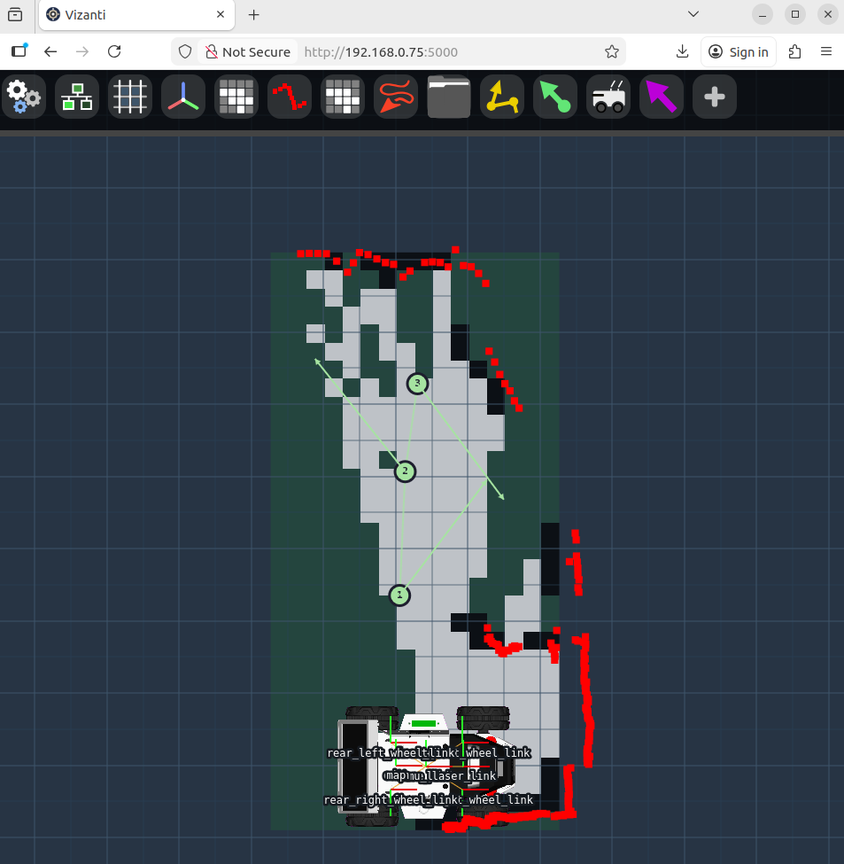
</p>

1. **✏️ 편집 모드** 버튼을 눌러 활성화합니다. (버튼 색상이 바뀜)
2. 지도 위 원하는 위치를 **클릭(또는 탭)** 하면 해당 좌표가 웨이포인트로 추가됩니다.
3. 추가된 웨이포인트는 지도 위에 번호 마커와 연결선으로 표시됩니다.
4. 편집이 끝나면 **✏️ 편집 모드** 버튼을 다시 눌러 비활성화합니다.

#### 웨이포인트 추가 — 좌표 직접 입력 방식

1. x, y, yaw 입력창에 값을 입력합니다. (yaw 단위: 라디안)
2. **+ 추가** 버튼을 누릅니다.

#### 순찰 실행

1. 웨이포인트를 1개 이상 추가합니다.
2. 반복 순찰이 필요하면 **🔁 반복 순찰** 버튼을 눌러 ON 상태로 만듭니다.
3. **▶ 순찰 시작** 버튼을 누릅니다.
4. 로봇이 순서대로 각 웨이포인트로 이동합니다.
5. 중단하려면 **■ 순찰 중지**를 누릅니다.

#### 경로 저장 및 불러오기

- **💾 경로 저장**: 이름 입력 후 현재 웨이포인트 목록을 서버에 저장합니다.
- **📂 경로 불러오기**: 저장된 경로 목록이 표시되며, 선택 시 해당 경로를 불러옵니다. 삭제 버튼도 제공됩니다.

<table align="center">
  <tr>
    <td>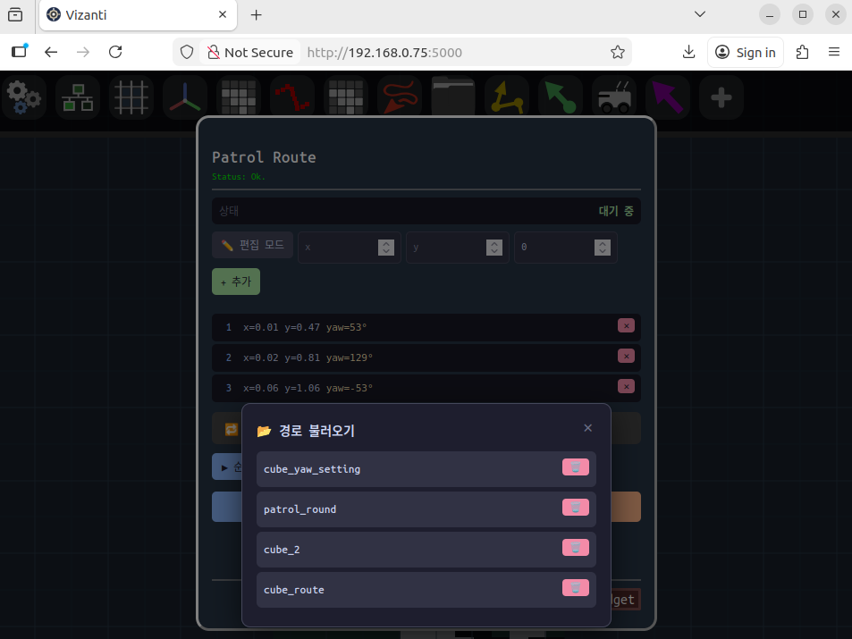</td>
    <td>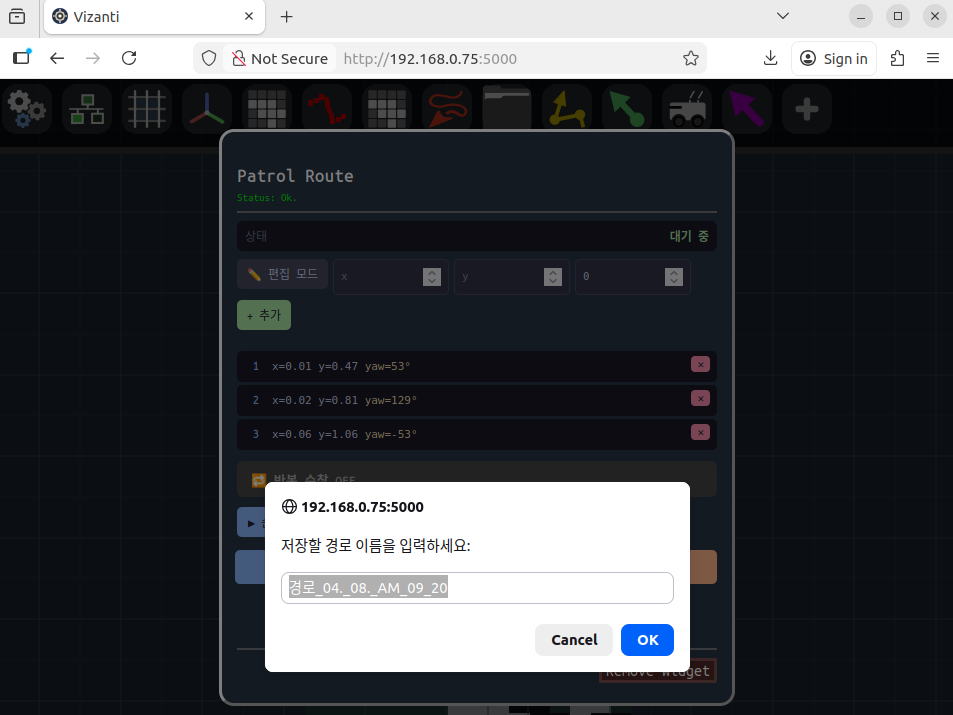</td>
  </tr>
</table>

### 백엔드 연동

| 동작 | API 호출 |
|------|----------|
| 순찰 시작 | `POST /api/waypoints` `{"points": [...], "loop": true/false}` |
| 순찰 중지 | `POST /api/navigate/cancel` |
| 경로 저장 | `POST /api/routes` `{"name": "<이름>", "points": [...]}` |
| 경로 목록 조회 | `GET /api/routes` |
| 경로 불러오기 | `GET /api/routes/<이름>` |
| 경로 삭제 | `DELETE /api/routes/<이름>` |

---

## 11. 문제 해결

### rosbridge 연결 아이콘이 빨간색인 경우

1. `ros2 launch auto_mapping auto_mapping.launch.py` 가 실행 중인지 확인합니다.
2. rosbridge 아이콘을 클릭하여 WebSocket 주소를 확인합니다.  
   올바른 형식: `ws://<로봇_IP>:5001`
3. 로봇 IP와 Vizanti 접속 IP가 일치하는지 확인합니다.

### 모바일에서 페이지가 열리지 않는 경우

로봇 핫스팟에 연결된 모바일 기기에서 모바일 데이터를 **반드시 끄세요**. 모바일 데이터가 활성화된 상태에서는 HTTP 요청이 잘못된 게이트웨이로 전송됩니다.

### 커스텀 위젯 패널에서 "patrol\_api 미연결" 오류

`patrol_api` 서버가 포트 8080에서 실행 중인지 확인합니다.

```bash
curl http://<로봇_IP>:8080/api/status
```

응답이 없으면 전체 스택을 재시작합니다.

### 지도가 표시되지 않는 경우

```bash
# /map 토픽이 퍼블리시되는지 확인
ros2 topic hz /map

# TF가 정상인지 확인
ros2 run tf2_ros tf2_echo map base_link
```

`/map`이 퍼블리시되지 않으면 SLAM Toolbox가 실행 중인지 확인합니다.

### Explorer Status 위젯의 Frontier 수가 0으로 고정

1. 로봇을 수동으로 조금 이동시켜 LiDAR가 새 영역을 스캔하게 합니다.
2. TF 오류가 없는지 확인합니다.  
   `ros2 run tf2_ros tf2_echo map base_link`
